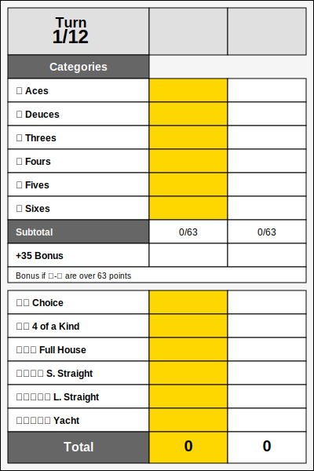
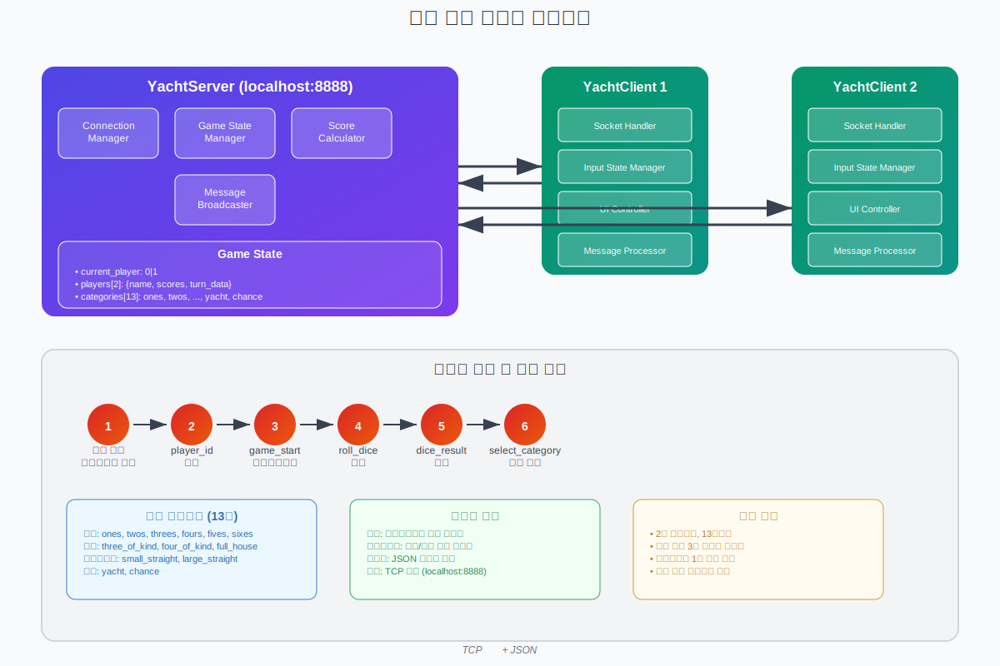

# Yacht Dice - Python Socket 구현

2인용 Yacht Dice 게임의 Python Socket 프로그래밍 구현체

## 게임 룰 (Yacht Dice)



## 상단 항목

| 이름 | 설명 | 최대점수 | 예시 |
|------|------|----------|------|
| Aces | 1이 나온 주사위 눈의 총합 | 5점 | ⚀⚀⚀⚄⚅ = 3점 |
| Deuces | 2가 나온 주사위 눈의 총합 | 10점 | ⚁⚁⚁⚄⚅ = 6점 |
| Threes | 3이 나온 주사위 눈의 총합 | 15점 | ⚂⚂⚂⚄⚅ = 9점 |
| Fours | 4가 나온 주사위 눈의 총합 | 20점 | ⚀⚁⚃⚃⚃ = 12점 |
| Fives | 5가 나온 주사위 눈의 총합 | 25점 | ⚀⚁⚄⚄⚄ = 15점 |
| Sixes | 6이 나온 주사위 눈의 총합 | 30점 | ⚀⚁⚅⚅⚅ = 18점 |

**보너스**: 상단 항목 합계 63점 이상 시 35점 추가

## 하단 항목

| 이름 | 설명 | 점수 | 예시 |
|------|------|------|------|
| Choice | 주사위 눈 5개의 총합 | 최대 30점 | ⚂⚃⚄⚅⚅ = 24점 |
| 4 of a Kind | 동일한 눈 4개 이상, 5개 총합 | 최대 30점 | ⚄⚅⚅⚅⚅ = 29점 |
| Full House | 3개+2개 조합, 5개 총합 | 최대 30점 | ⚄⚄⚅⚅⚅ = 28점 |
| Small Straight | 연속 4개 이상 | 고정 15점 | ⚀⚁⚂⚃⚅ = 15점 |
| Large Straight | 연속 5개 | 고정 30점 | ⚀⚁⚂⚃⚄ = 30점 |
| Yacht | 동일한 눈 5개 | 고정 50점 | ⚀⚀⚀⚀⚀ = 50점 |

### 특이사항
- 요트(5개 동일)를 모든 항목에 사용 가능
- 상단 보너스 기준: 각 숫자 3개씩 = 63점 (3+6+9+12+15+18)

### 기본 구조
- **플레이어**: 2명
- **주사위**: 5개
- **턴당 굴리기**: 최대 3회 (첫 굴리기 + 재굴리기 2회)
- **게임 종료**: 모든 카테고리 완성 시
- **승리 조건**: 총점이 높은 플레이어


### 게임 진행
1. 플레이어 1이 먼저 시작
2. 턴당 주사위를 최대 3회까지 굴릴 수 있음
3. 재굴리기 시 원하는 주사위만 선택 가능
4. 턴 종료 시 반드시 하나의 카테고리에 점수 기록
5. 13라운드 후 총점 비교하여 승부 결정

## 기술 스택

### Socket 프로그래밍
- **프로토콜**: TCP (Transmission Control Protocol)
- **라이브러리**: Python 표준 `socket` 모듈
- **통신 방식**: JSON 기반 메시지 교환
- **아키텍처**: Client-Server 모델

### 핵심 기술 요소

#### 서버 (yacht_server.py)
```python
# TCP 소켓 생성 및 바인딩
server = socket.socket(socket.AF_INET, socket.SOCK_STREAM)
server.bind(('localhost', 8888))
server.listen(2)

# 멀티 클라이언트 처리
threading.Thread(target=self.handle_client, args=(client, player_id)).start()
```

#### 클라이언트 (yacht_client.py)
```python
# 서버 연결
self.socket.connect(('localhost', 8888))

# 비동기 메시지 수신
threading.Thread(target=self.receive_messages, daemon=True).start()
```

#### 통신 프로토콜
```json
// 주사위 굴리기
{"type": "roll_dice", "data": {}}

// 재굴리기 (선택된 주사위만)
{"type": "roll_dice", "data": {"reroll": [0, 2, 4]}}

// 카테고리 선택
{"type": "select_category", "data": {"category": "yacht"}}

// 서버 응답
{"type": "dice_result", "data": {"dice": [1,2,3,4,5], "player": 0, "rolls_left": 2}}
```

* 통신 프로토콜로 json 포맷 사용함
* 작은 파일 크기를 가져 효과적으로 전달할 수 있고, 가시성과 가독성도 뛰어남
* 원하는 클래스를 손쉽게 설계할 수 있어 선택함

## 시스템 아키텍처



### 동작 흐름

```
[서버 시작] → [클라이언트 접속 대기] → [2명 접속 완료] → [게임 시작]
                                ↓
[플레이어 ID 할당] → [게임 상태 브로드캐스트] → [턴 기반 게임 진행]
                                ↓
[주사위 굴리기] → [재굴리기 (선택적)] → [카테고리 선택] → [점수 계산]
                                ↓
[턴 변경] → [13라운드 완료 체크] → [게임 종료] 또는 [다음 턴]
```

### 컴포넌트 구조

#### 서버 컴포넌트
- **Connection Manager**: 클라이언트 연결 관리
- **Game State Manager**: 게임 상태 동기화
- **Score Calculator**: 점수 계산 로직
- **Message Broadcaster**: 전체 클라이언트 메시지 전송

#### 클라이언트 컴포넌트
- **Socket Handler**: 서버 통신 관리
- **Input State Manager**: 사용자 입력 상태 제어
- **UI Controller**: 콘솔 기반 사용자 인터페이스
- **Message Processor**: 서버 메시지 처리

### 동시성 처리
- **서버**: `threading.Thread`로 각 클라이언트 개별 처리
- **클라이언트**: 메시지 수신과 사용자 입력을 별도 스레드에서 처리
- **동기화**: JSON 메시지 기반 상태 동기화

## 설치 및 실행

### 환경 요구사항
- Python 3.12+
- UV (Ultra-fast Python package installer)

### 프로젝트 설정

* [uv 설치](https://docs.astral.sh/uv/#installation)

```powershell
powershell -ExecutionPolicy ByPass -c "irm https://astral.sh/uv/install.ps1 | iex"
```

```bash
# 프로젝트 의존성 설치
uv sync

# 가상환경 활성화 (자동)
# UV는 자동으로 가상환경을 관리함
```

### 실행 방법

#### 1. 서버 실행
```bash
# 터미널 1에서 서버 시작
uv run app/src/yacht_server.py
```

#### 2. 클라이언트 실행
```bash
# 터미널 2에서 플레이어 1
uv run app/src/yacht_client.py

# 터미널 3에서 플레이어 2  
uv run app/src/yacht_client.py
```

### 게임 플레이 방법

#### 플레이어 1 턴
```
>>> 당신의 턴! 주사위를 굴리려면 'r' 입력: r
주사위 결과: [3, 1, 4, 2, 5]
남은 굴리기: 2

>>> 다시 굴릴 주사위 선택 (예: 1,3,5) 또는 엔터로 점수 선택: 1,3
주사위 결과: [6, 1, 2, 2, 5]
남은 굴리기: 1

>>> 다시 굴릴 주사위 선택 (예: 1,3,5) 또는 엔터로 점수 선택: [엔터]

점수 카테고리 선택:
1. ones: 1점
2. twos: 4점
3. threes: 0점
...
>>> 선택 (숫자): 2
```

#### 서버 로그 확인
```
[14:30:15] 서버 시작 - 포트 8888
[14:30:20] 플레이어 1 접속: ('127.0.0.1', 53897)
[14:30:25] 플레이어 2 접속: ('127.0.0.1', 53898)
[14:30:25] 게임 시작!
[14:30:30] 플레이어 1 첫 굴리기: [3, 1, 4, 2, 5]
[14:30:35] 플레이어 1 재굴리기 [0, 2]: [3, 1, 4, 2, 5] -> [6, 1, 2, 2, 5]
[14:30:40] 플레이어 1 점수 기록: twos = 4
```

